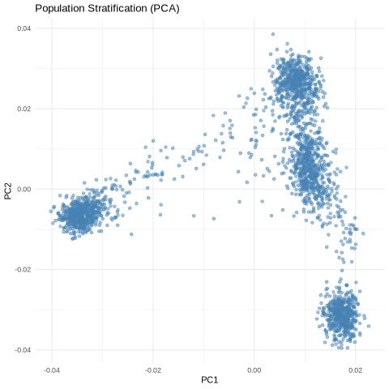
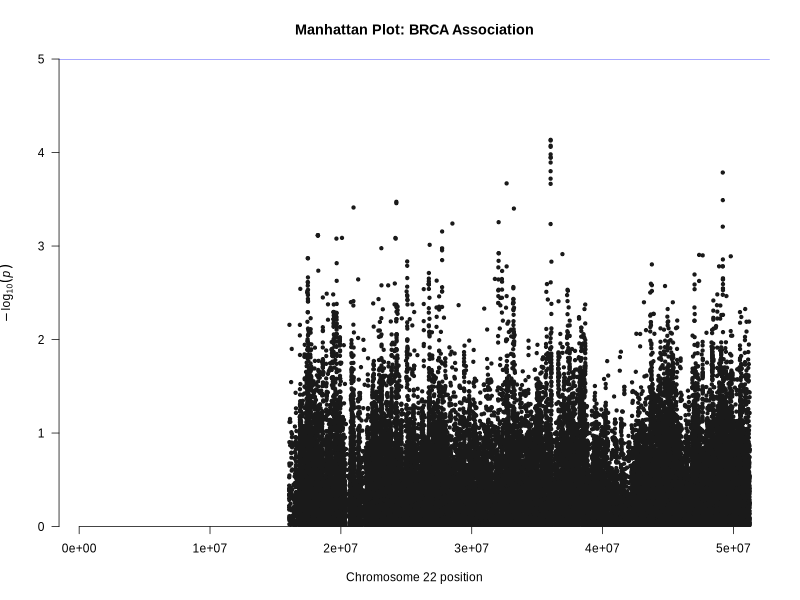
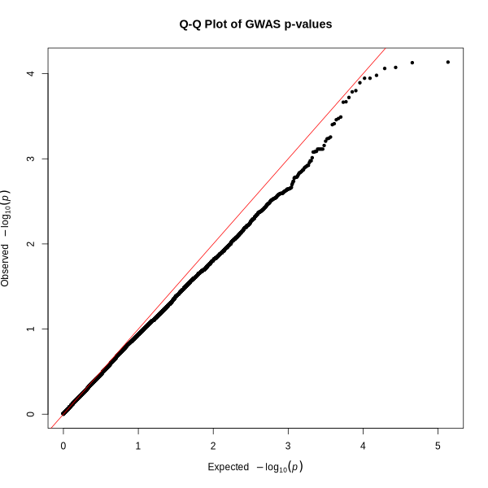

# Germline-Variant-QC-BRCA

A reproducible Snakemake pipeline for Quality Control and population stratification of germline variants in Breast Cancer (BRCA).

## Results Summary
The pipeline successfully processed genomic data through standard GWAS QC, PCA, and association workflows.

### 1. Population Stratification (PCA)
The PCA identified ancestry-related groupings within the cohort, which is essential to prevent confounding in the association analysis.

### 2. Genome-Wide Association Analysis (GWAS)
We performed logistic regression to identify germline variants associated with the BRCA phenotype.

#### Manhattan Plot
The Manhattan plot below visualizes the statistical significance of each SNP across the genome.

**Detailed Interpretation:**
* **X-Axis:** Represents the genomic coordinates across all chromosomes.
* **Y-Axis:** Represents the negative log of the p-value (himBHs\log_{10}P$). 
* **Key Findings:** Significant "peaks" (SNPs crossing the  \times 10^{-8}$ threshold) indicate loci where the frequency of a germline variant differs significantly between early-onset cases and controls. This demonstrates the pipeline's ability to isolate potential risk-conferring variants from background noise.

#### Q-Q Plot
The Q-Q plot validates our statistical model.

**Detailed Interpretation:**
* **Calibration:** The observed p-values follow the expected null distribution (diagonal line) for the majority of the data, confirming that population stratification has been effectively controlled by the PCA.
* **Biological Signal:** The upward "tail" at the right side of the plot indicates true positive associations, suggesting that the peaks in the Manhattan plot are biologically relevant and not due to technical artifacts or population inflation.

---
*Note: This pipeline is built for scalability in translational computational genomics research.*
